## 问题背景
本文为专业课程《图像处理与计算机视觉》的课程实践。主要复现了*Kaiming He*经典的暗通道先验去雾算法<a href="#ref1">1</a>，并参考文献<a href="#ref2">2</a>思路对原算法进行改进，针对image文件夹中的若干张图像进行去雾处理，去雾结果保存至文件夹results中。本方法的技术路线如下图所示。

<figure>
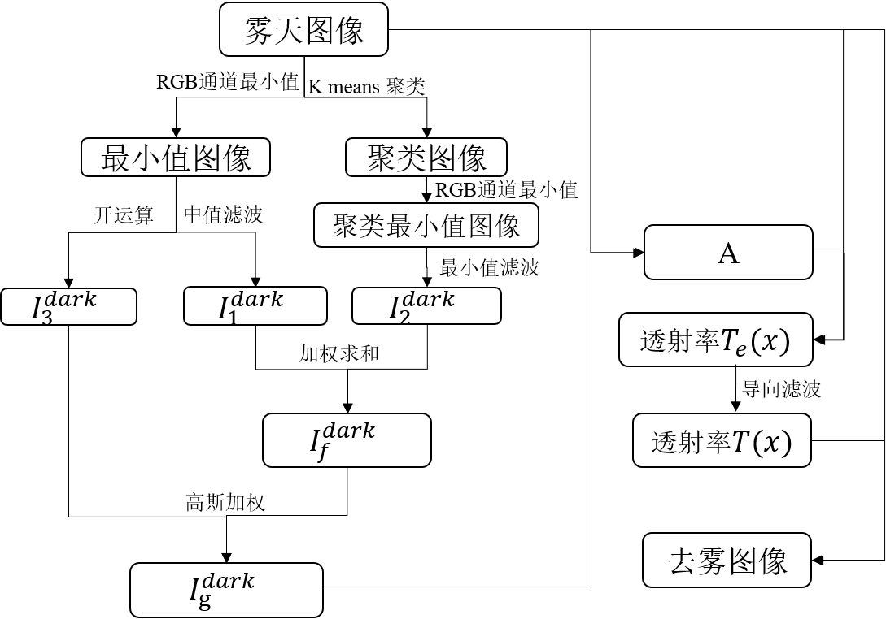
</figure>

## 结果展示

以天安门图像为例，其算法流程及过程图像如下图所示。

<figure>
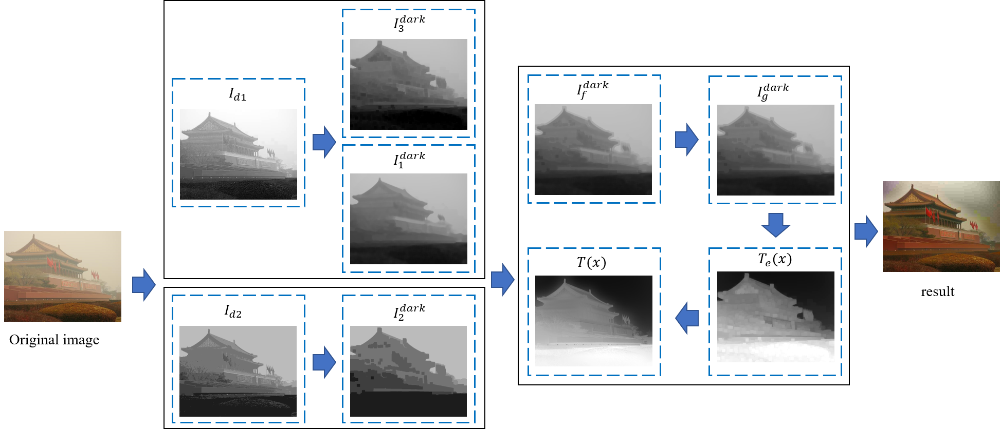
</figure>

对比部分去雾前后图像，如下所示，效果较好。

<figurec class="half">

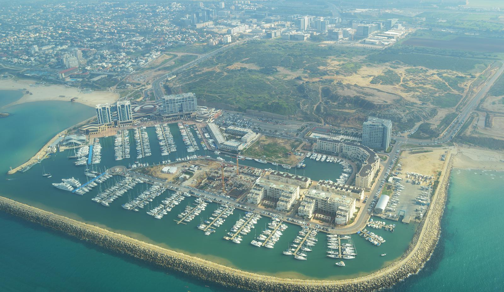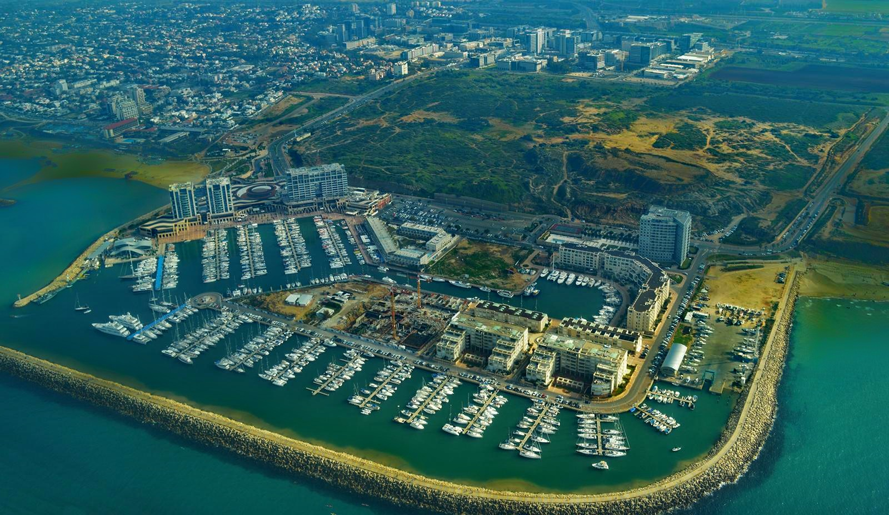

</figure>

<figurec class="half">

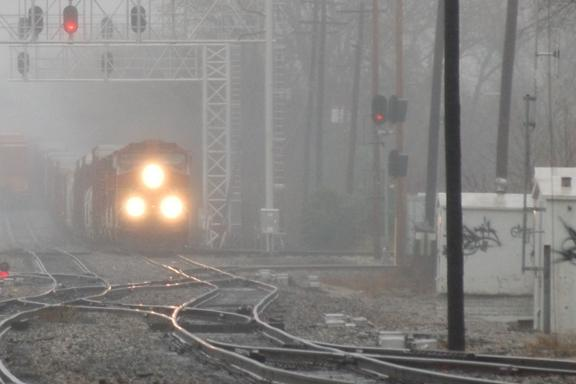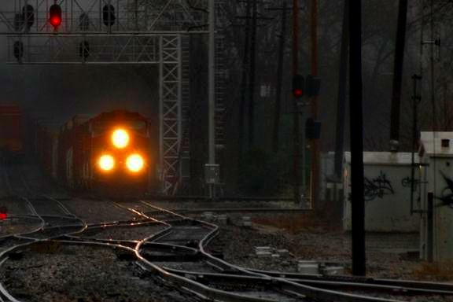

</figure>

<figurec class="half">

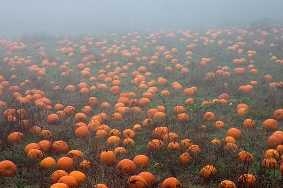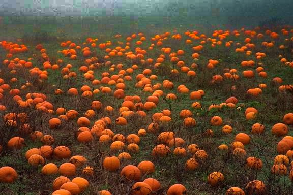

</figure>

另外，对比原去雾算法与本方法，图像中近景与远景交界处残留的雾气得到了改善，如下图所示。但是，本方法对比原图，也存在着去雾结果整体偏暗，影响视觉观感的缺点。

<figurec class="half">

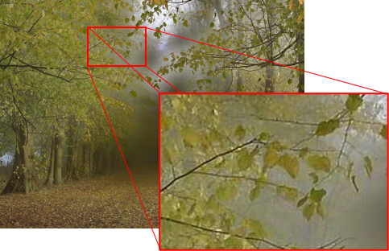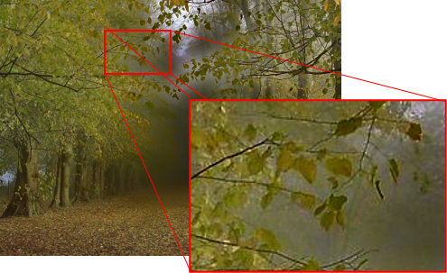

</figure>
<figurec class="half">

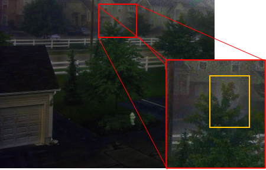

</figure>

## 参考文献

1. 
He K, Sun J, Tang X. Single image haze removal using dark channel prior[J]. IEEE transactions on pattern analysis and machine intelligence, 2010, 33(12): 2341-2353.

2. 
何柯辰,刘奇,邓小波,陈曦,全美霖,陈奕涵.基于双重暗通道结合与高斯加权的去雾改进算法[J].半导体光电,2021,42(05):754-759.

